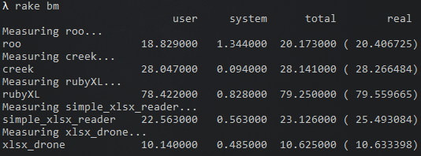

# xlsx_drone

[](#xlsx_drone)
[](#xlsx_drone)
[](#xlsx_drone)

Fast _Microsoft Excel's_ **\*.xlsx** reader. Binding of [C's xlsx_drone](https://github.com/damian-m-g/xlsx_drone) lib.

## Table of contents

* [Summary](#summary)
* [Installation](#installation)
* [Usage](#usage)
* [TODO](#todo)
* [News](#news)  
* [License](#license)

## Summary

The xlsx_drone gem highlight specifically in runtime speed. This is because almost all the process of gathering information happens in well constructed -for speed- native C code.

[You can find a benchmark inside the repository](https://github.com/damian-m-g/xlsx_drone_rb/blob/master/test/benchmark/speed.rb) that measure the **reading speed** of the most known (and used) Ruby libraries for *.xlsx's reading/writing. The results gathered in my old notebook, reading 200000 rows × 3 columns (number, string and date) are as follow:



**x2** times faster than the fastest one.

You can run this test on your own computer with the `rake bm` task.

## Installation

Use the _gem_ command that comes with your Ruby installation:

`gem install xlsx_drone`

## Usage

```ruby
require 'xlsx_drone'

path_to_xlsx = 'foo.xlsx'
wb = XLSXDrone.open(path_to_xlsx) #: XLSXDrone::Workbook

sheets_amount = wb.sheets_amount #: Integer
# you can pass its index (starts with 1) or its name as argument
sheet = wb.load_sheet(1) #: XLSXDrone::Sheet
puts "Sheet #1 name: #{sheet.name}"
puts "Sheet #1 is #{sheet.empty? ? 'empty' : 'not-empty'}"

1.upto(sheet.last_row) do |row|
  'A'.upto(sheet.last_column) do |column|
    p sheet.read_cell(row, column)
  end
end

# when done with the wb, but non-mandatory (automatically done on normal exit)
wb.close
```

## TODO

All ideas about new implementations are thoroughly thought to keep the essence of the library, which is to be fast and simple. Hence, next TODOs could be taken into account or dismissed based on that.

Also, consider that this TODO list is somehow concatenated to the [C's xlsx_drone](https://github.com/damian-m-g/xlsx_drone#todo) TODO list. Changes implemented there, will be _immediately_ mirrored here.

- C's xlsx_drone has in its plans to provide **writing support** for xlsx files. As soon as this is implemented there, I'll perform the neccessary binding.
- Consider making `XLSXDrone::Workbook#load_sheet()` to keep a reference to the loaded sheet as an accessible instance variable (i.e.: @loaded_sheets).

**Be free to [make (or upvote)](https://github.com/damian-m-g/xlsx_drone_rb/issues) any feature request.**

## News

Version 0.6.0 introduces:
* Support for Unix-like x64 OS potentially guaranteed.
* Dependencies updated.
* Bugfixes.

## License

#### [MIT](https://github.com/damian-m-g/xlsx_drone_rb/blob/master/LICENSE)
